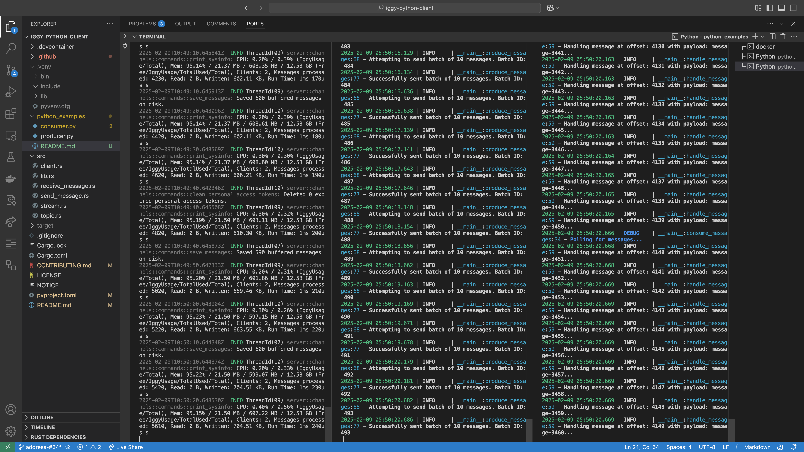

## Python Examples

### 1. Start the Producer:

Navigate to the `python_examples` directory and run:

```
python producer.py
```

### 2. Start the Consumer:

Still in the `python_examples` directory, run the consumer using a separate terminal:

```
python consumer.py
```

Here's how the output should look (show images of the output):
